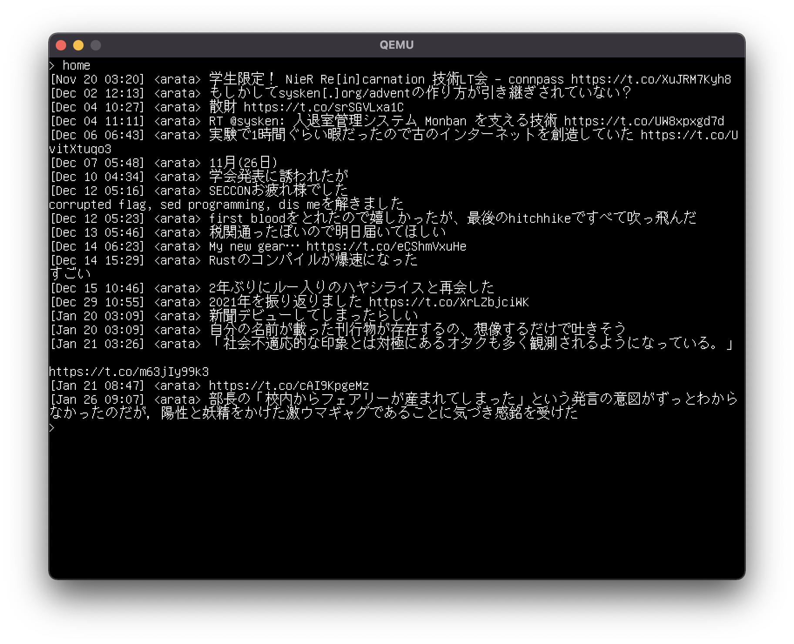

# mitnal

Twitter client for UEFI.

## Screenshot



## Requirements

You need to enable "HTTP Protocol Stack Support" in your UEFI.

## How to build

Create a `MitnalPkg/Secrets` file as follows:

```c
static const CHAR8 *gConsumerKey = "<Your consumer key>";
static const CHAR8 *gConsumerSecret = "<Your consume secret>";
static const CHAR8 *gAccessToken = "<Your access token>";
static const CHAR8 *gAccessTokenSecret = "<Your access token secret>";
```

Then,

```bash
$ make docker/build
$ make run
```

## Usage

Here is a list of available command:

- `home`: show your timeline
- `tweet hello`:  tweet 'hello'
